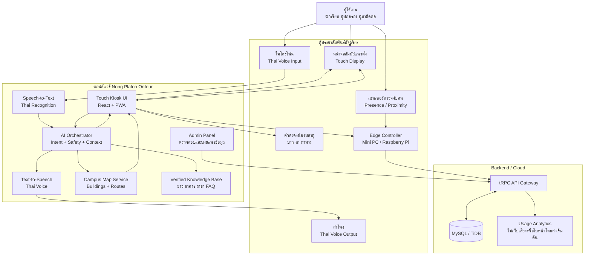
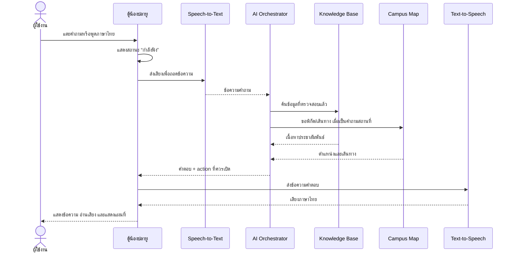

# น้องปลาทู PLato Robo Guide

## System Architecture และ UI/UX Blueprint

เอกสารนี้กำหนดโครงสร้างต้นแบบของ **ตู้ประชาสัมพันธ์อัจฉริยะ** สำหรับการแข่งขันประเภทสิ่งประดิษฐ์ด้านนวัตกรรมและเทคโนโลยี หุ่นยนต์ประชาสัมพันธ์อัจฉริยะ โดยออกแบบให้เป็นหุ่นยนต์ประจำจุดที่มีตัวตนทางกายภาพ รับข้อมูลจากผู้ใช้งาน ประมวลผล และตอบกลับด้วยหน้าจอสัมผัส เสียง และแผนที่

## 1. แนวคิดผลิตภัณฑ์

> **น้องปลาทู** คือผู้ช่วยประชาสัมพันธ์ประจำวิทยาลัยที่สื่อสารได้ด้วยเสียงและการสัมผัส ให้ข้อมูลข่าวสาร อาคาร สาขาวิชา การสมัครเรียน และเส้นทางภายในวิทยาลัย โดยมี **Nong Platoo Ontour** เป็นแพลตฟอร์มซอฟต์แวร์และฐานข้อมูลกลาง

รูปแบบที่แนะนำคือ **ตู้ตั้งพื้นแบบเคลื่อนย้ายได้** มีหน้าจอแนวตั้งและตัวละครหุ่นยนต์เสมือนบนหน้าจอ ไม่จำเป็นต้องเดินอัตโนมัติ เพราะแกนของโจทย์คือการประชาสัมพันธ์และการโต้ตอบที่ใช้งานได้จริง

## 2. ภาพรวมสถาปัตยกรรม



## 3. แบ่งชั้นของระบบ

| ชั้นระบบ | องค์ประกอบ | หน้าที่หลัก | ข้อกำหนดสำคัญ |
|---|---|---|---|
| Physical Layer | ตู้, จอสัมผัส, ไมโครโฟน, ลำโพง, ไฟสถานะ, เซนเซอร์ | เป็นจุดให้บริการที่จับต้องได้ | เดินสายเรียบร้อย ปลอดภัย ทำความสะอาดง่าย |
| Edge Layer | Mini PC หรือ Raspberry Pi | เปิด Kiosk Mode เชื่อมอุปกรณ์และเก็บ cache | เปิดเครื่องแล้วเข้าแอปอัตโนมัติ |
| Experience Layer | React Touch Kiosk UI, ตัวละครน้องปลาทู | แสดงเมนู คำตอบ แผนที่ และสถานะการสนทนา | ปุ่มใหญ่ ไม่ต้องพิมพ์ รองรับผู้สูงอายุ |
| Intelligence Layer | STT, AI Orchestrator, TTS | ฟัง วิเคราะห์ ค้นข้อมูล และตอบเสียง | ใช้ข้อมูลที่ตรวจสอบแล้ว ห้ามเดาข้อมูลสำคัญ |
| Data Layer | Knowledge Base, อาคาร, ชั้น, ข่าว, FAQ | เป็นแหล่งข้อมูลประชาสัมพันธ์ | ทุกข้อมูลมีสถานะร่าง/ตรวจสอบแล้ว/เผยแพร่ |
| Admin Layer | Admin Panel | เพิ่ม แก้ไข ตรวจสอบ และเผยแพร่ข้อมูล | มีประวัติการแก้ไขและผู้รับผิดชอบ |
| Integration Layer | Google Maps/แผนที่วิทยาลัย, QR Code | แสดงตำแหน่งและส่งข้อมูลไปมือถือ | มี fallback เป็นแผนผังออฟไลน์ |

## 4. ฮาร์ดแวร์ต้นแบบ

### 4.1 ชุดขั้นต่ำที่ควรทำให้ใช้งานได้จริง

| อุปกรณ์ | ข้อเสนอ | เหตุผล |
|---|---|---|
| จอสัมผัส | 24–32 นิ้ว แนวตั้ง | เหมาะกับการยืนใช้งานและปุ่มขนาดใหญ่ |
| Edge Computer | Mini PC หรือ Raspberry Pi 5 | เปิดเว็บแบบ Kiosk และควบคุมอุปกรณ์ |
| ไมโครโฟน | USB microphone หรือ microphone array | รับเสียงจากผู้ใช้งานด้านหน้าตู้ |
| ลำโพง | ลำโพง 2.0 ขนาดเล็ก | ให้เสียงพูดชัดในพื้นที่ประชาสัมพันธ์ |
| เซนเซอร์ | PIR หรือ ToF sensor | ปลุกหน้าจอเมื่อตรวจพบคน โดยไม่ต้องจำใบหน้า |
| ไฟสถานะ | RGB LED ring | แสดงพร้อมใช้งาน กำลังฟัง และกำลังตอบ |
| โครงตู้ | โครงเหล็ก/ไม้ปิดผิว/อะคริลิก | ทำให้เห็นว่าเป็นสิ่งประดิษฐ์จริงและบำรุงรักษาง่าย |
| UPS หรือแบตเตอรี่สำรอง | ขนาดเล็ก | ป้องกันระบบดับระหว่างการสาธิต |
| ปุ่มฉุกเฉิน | ปุ่มหยุดเสียงหรือปิดระบบ | เพิ่มความปลอดภัยและความน่าเชื่อถือ |

### 4.2 แนวคิดการจัดวางตู้

```text
┌─────────────────────────────────┐
│  ไฟสถานะ + โลโก้ “น้องปลาทู”      │  ← พร้อม / ฟัง / ตอบ
│                                 │
│       [ ใบหน้าตัวละคร ]         │  ← ตา ปาก อารมณ์
│                                 │
│  ┌───────────────────────────┐  │
│  │  สวัสดีครับ แตะเพื่อเริ่ม  │  │
│  │  [สมัครเรียน] [ดูแผนที่]   │  │  ← จอสัมผัส
│  │  [ข่าวสาร]   [ถามด้วยเสียง]│  │
│  └───────────────────────────┘  │
│     ไมโครโฟน        ลำโพง       │
│                                 │
│  QR Code | ปุ่มหยุดเสียง | ล้อ  │
└─────────────────────────────────┘
```

## 5. การทำงานของระบบสนทนา



## 6. หลักการข้อมูลและความปลอดภัย

ระบบควรแบ่งคำตอบเป็นสองประเภท ได้แก่ **คำตอบจากฐานข้อมูลที่ตรวจสอบแล้ว** และ **คำตอบทั่วไปที่ไม่ใช่ข้อมูลทางการ** คำถามเกี่ยวกับวันสมัครเรียน เบอร์โทรศัพท์ เวลาเปิดทำการ หรือประกาศต้องตอบจากข้อมูลที่ผู้ดูแลอนุมัติเท่านั้น หากไม่พบข้อมูล ระบบต้องแจ้งอย่างชัดเจนว่าอยู่ระหว่างรอการตรวจสอบและแนะนำช่องทางติดต่อเจ้าหน้าที่

ระบบต้นแบบควรใช้เซนเซอร์ตรวจจับการมีอยู่ของคนโดยไม่จัดเก็บใบหน้าและไม่บันทึกเสียงถาวร เว้นแต่ได้รับความยินยอมโดยชัดเจน ควรเก็บเฉพาะสถิติที่ไม่ระบุตัวตน เช่น จำนวนการใช้งาน หมวดคำถาม และเมนูที่ถูกเลือก

## 7. UI/UX ของหน้าจอสัมผัส

### หลักการออกแบบ

- ใช้ **ปุ่มขนาดใหญ่** อย่างน้อยประมาณ 48–56 px เพื่อให้แตะง่าย
- ทุกหน้ามีปุ่ม **หน้าแรก**, **ย้อนกลับ**, **หยุดเสียง** และ **ฟังซ้ำ**
- ไม่บังคับให้ผู้ใช้พิมพ์ โดยใช้เมนูคำถามสำเร็จรูปเป็นหลัก
- แสดงข้อความบนจอทุกครั้งที่มีเสียงพูด
- ใช้คำสั้น ภาษาธรรมดา และมีภาพประกอบ
- ใช้สีสถานะชัดเจน: เขียว = พร้อม, ฟ้า = กำลังฟัง, ม่วง = กำลังคิด, ส้ม = กำลังตอบ, แดง = แจ้งเตือน
- ให้ผู้ใช้กลับสู่หน้าแรกอัตโนมัติหลังไม่มีการใช้งาน 60–90 วินาที

### Screen 01: Welcome / Idle

```text
┌──────────────────────────────────────────────┐
│  Nong Platoo Ontour                 ● พร้อมให้บริการ │
│                                              │
│              (•‿•)                           │
│          สวัสดีครับ ผมน้องปลาทู               │
│   ผู้ช่วยประชาสัมพันธ์วิทยาลัยฯ              │
│                                              │
│   ต้องการสอบถามข้อมูลเรื่องใดครับ            │
│                                              │
│  ┌────────────┐ ┌────────────┐ ┌───────────┐ │
│  │ สมัครเรียน │ │ ค้นหาอาคาร │ │ ข่าวสาร   │ │
│  └────────────┘ └────────────┘ └───────────┘ │
│  ┌─────────────────────────────────────────┐ │
│  │        แตะไมโครโฟนเพื่อพูดถาม          │ │
│  └─────────────────────────────────────────┘ │
│                         [ภาษาไทย] [English] │
└──────────────────────────────────────────────┘
```

### Screen 02: Main Menu แบบ 6 ปุ่ม

```text
┌──────────────────────────────────────────────┐
│  ← กลับหน้าแรก             น้องปลาทู ● พร้อม  │
│                                              │
│          วันนี้ให้ผมช่วยเรื่องอะไรครับ       │
│                                              │
│  ┌──────────────┐ ┌──────────────┐           │
│  │ สมัครเรียน   │ │ สาขาวิชา     │           │
│  │ เอกสาร/กำหนดการ│ │ ค้นหาความสนใจ│           │
│  └──────────────┘ └──────────────┘           │
│  ┌──────────────┐ ┌──────────────┐           │
│  │ อาคาร/แผนที่ │ │ ข่าวสาร      │           │
│  │ ดูเส้นทาง     │ │ กิจกรรม      │           │
│  └──────────────┘ └──────────────┘           │
│  ┌──────────────┐ ┌──────────────┐           │
│  │ ติดต่อวิทยาลัย│ │ ถามด้วยเสียง │           │
│  │ หน่วยงาน/เบอร์│ │ ไมโครโฟน     │           │
│  └──────────────┘ └──────────────┘           │
└──────────────────────────────────────────────┘
```

### Screen 03: Voice Interaction

```text
┌──────────────────────────────────────────────┐
│  ← ยกเลิก                  กำลังฟัง ●        │
│                                              │
│              (◉‿◉)                           │
│         พูดคำถามได้เลยครับ                   │
│                                              │
│             )) ))) (((                       │
│          [   ไมโครโฟน   ]                    │
│                                              │
│  ตัวอย่าง: “อาคารช่างยนต์อยู่ที่ไหน”        │
│                                              │
│            [แตะเพื่อหยุดฟัง]                 │
└──────────────────────────────────────────────┘
```

### Screen 04: Answer + Map

```text
┌──────────────────────────────────────────────┐
│  ← กลับเมนู                 น้องปลาทู ● ตอบ   │
│  คำถาม: อาคารช่างยนต์อยู่ที่ไหน              │
│                                              │
│  ┌─────────────────────┐ ┌────────────────┐ │
│  │                     │ │ คำตอบจากน้องปลาทู│ │
│  │      CAMPUS MAP     │ │ อาคารช่างยนต์  │ │
│  │   ● จุดเริ่มต้น      │ │ อยู่ทางทิศ...  │ │
│  │        ───────►      │ │ เดินประมาณ ... │ │
│  │          ● อาคาร    │ │                │ │
│  └─────────────────────┘ │ [ฟังซ้ำ] [QR]   │ │
│                          └────────────────┘ │
│  [เริ่มนำทาง] [ดูชั้นในอาคาร] [ถามต่อ]      │
└──────────────────────────────────────────────┘
```

## 8. ตัวละครน้องปลาทู

### รูปลักษณ์

น้องปลาทูควรมี silhouette จำง่ายและทำซ้ำได้ทั้งบนจอ ป้าย และเอกสารแข่งขัน รูปแบบที่แนะนำคือหุ่นยนต์บริการสีกรมท่าและสีเขียวอมฟ้า มีหน้าจอใบหน้าทรงกลม ดวงตาขนาดใหญ่ และตรา Nong Platoo Ontour บริเวณหน้าอก ไม่ควรใช้รายละเอียดเล็กมาก เพราะต้องมองเห็นได้จากระยะ 2–3 เมตร

### ชุดสถานะตัวละคร

| สถานะ | สีหลัก | Animation | ข้อความบนจอ |
|---|---|---|---|
| Idle | เขียวอมฟ้า | กะพริบตา ชูมือเบา ๆ | พร้อมให้บริการ |
| Greeting | เขียว | โบกมือ ยิ้ม | สวัสดีครับ |
| Listening | ฟ้า | วงแหวนไมโครโฟนเต้น ปากหยุด | กำลังฟังครับ |
| Thinking | ม่วง | จุดสามจุดและแสงหมุน | กำลังค้นหาข้อมูล |
| Speaking | ส้มอ่อน | ปากขยับตามจังหวะเสียง | กำลังตอบครับ |
| Error | แดงอ่อน | ทำหน้าสงสัย ก้มศีรษะเล็กน้อย | ขออภัย ลองใหม่อีกครั้ง |

### กติกา Animation

Animation ควรสั้นและไม่รบกวนการอ่าน ใช้การเปลี่ยนเฉพาะ opacity, transform และการขยับปาก ไม่ควรทำให้ทั้งหน้าจอสั่นหรือเคลื่อนไหวตลอดเวลา ผู้ใช้ต้องสามารถกดหยุดเสียงและข้าม Animation ได้เสมอ

## 9. MVP สำหรับทำให้เสร็จและสาธิตได้

ลำดับที่ควรทำก่อนการแข่งขันคือสร้างตู้จริงให้เปิดเว็บ Kiosk ได้ เพิ่มไมโครโฟนและลำโพง เพิ่มตัวละคร 5 สถานะ ทำคำถามสัมผัส 6 หมวด เพิ่มคำถามเสียงภาษาไทย 3–5 กรณี เพิ่มคำตอบจากฐานข้อมูลอาคารและข่าวสาร และทำ Demo แบบต่อเนื่องโดยไม่ต้องเข้าสู่ระบบหรือพิมพ์ข้อมูล

ส่วนที่ควรทำเป็นระยะต่อไปคือโหมด Offline, QR Code ไปยังมือถือ, เส้นทางสำหรับผู้ใช้รถเข็น, Analytics แบบไม่ระบุตัวตน และ Admin workflow ที่มีผู้ตรวจสอบก่อนเผยแพร่

## 10. เกณฑ์ทดสอบก่อนวันแข่ง

| การทดสอบ | เป้าหมายผ่าน |
|---|---|
| เปิดเครื่อง | เข้า Kiosk UI ภายใน 30 วินาที |
| แตะคำถาม | ได้คำตอบภายใน 3 ขั้นตอนไม่เกินไป |
| พูดถาม | รับคำถามภาษาไทยในระยะใช้งานจริง |
| เสียงตอบกลับ | ได้ยินชัดและมีข้อความประกอบ |
| แผนที่ | แสดงหมุดอาคารและเส้นทางที่ตรวจสอบแล้ว |
| ไม่มีอินเทอร์เน็ต | ยังแสดงเมนู ข้อมูลพื้นฐาน และแผนผังออฟไลน์ |
| ไม่พบข้อมูล | ไม่เดาข้อมูล แจ้งช่องทางติดต่อเจ้าหน้าที่ |
| ความเป็นส่วนตัว | ไม่บันทึกใบหน้าและเสียงโดยค่าเริ่มต้น |
| การเข้าถึง | ใช้เมนูหลักได้โดยไม่ต้องพิมพ์ |

## สรุป

สถาปัตยกรรมนี้ทำให้น้องปลาทูมีองค์ประกอบครบสามด้าน ได้แก่ **ฮาร์ดแวร์ที่จับต้องได้**, **ซอฟต์แวร์ที่โต้ตอบได้**, และ **ฐานข้อมูลประชาสัมพันธ์ที่ตรวจสอบได้** การเลือกเป็นตู้ประจำจุดช่วยลดความเสี่ยงด้านกลไก แต่ยังตรงกับแนวคิดหุ่นยนต์ประชาสัมพันธ์อัจฉริยะ เพราะระบบสามารถรับรู้คำถาม ประมวลผล และตอบกลับต่อผู้ใช้งานได้จริง

## References

[1]: https://www.w3.org/WAI/WCAG22/ "Web Content Accessibility Guidelines (WCAG) 2.2"

[2]: https://developers.google.com/maps/documentation/javascript/overview "Google Maps JavaScript API Overview"

[3]: https://developer.mozilla.org/en-US/docs/Web/API/Web_Speech_API "Web Speech API - MDN Web Docs"
